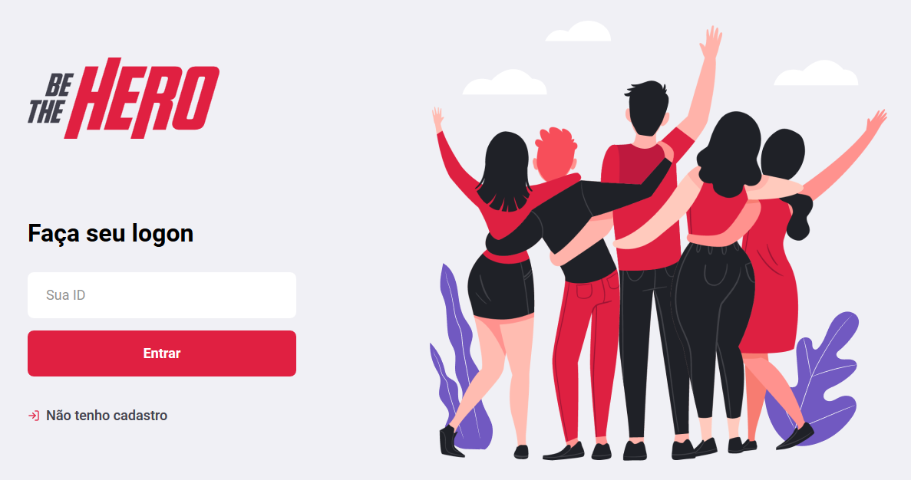
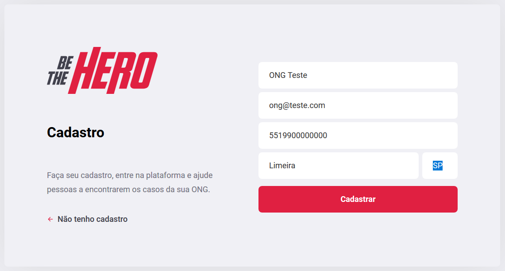
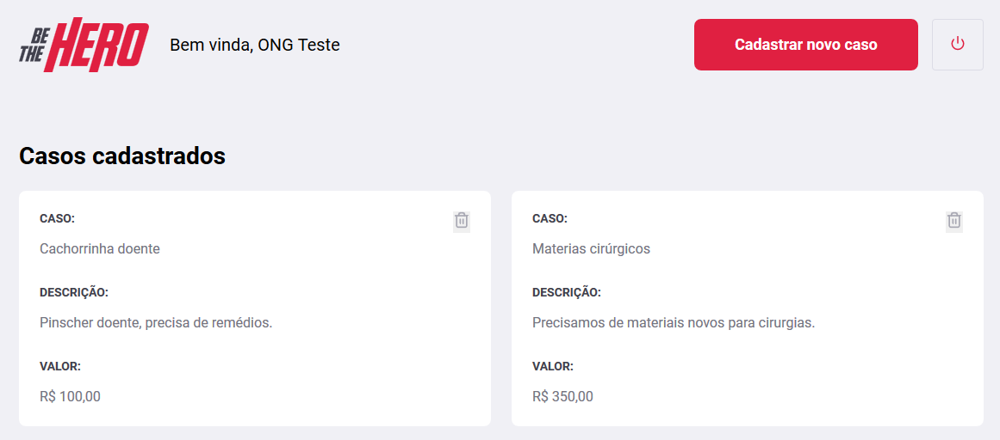
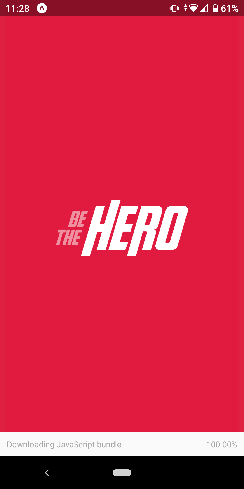
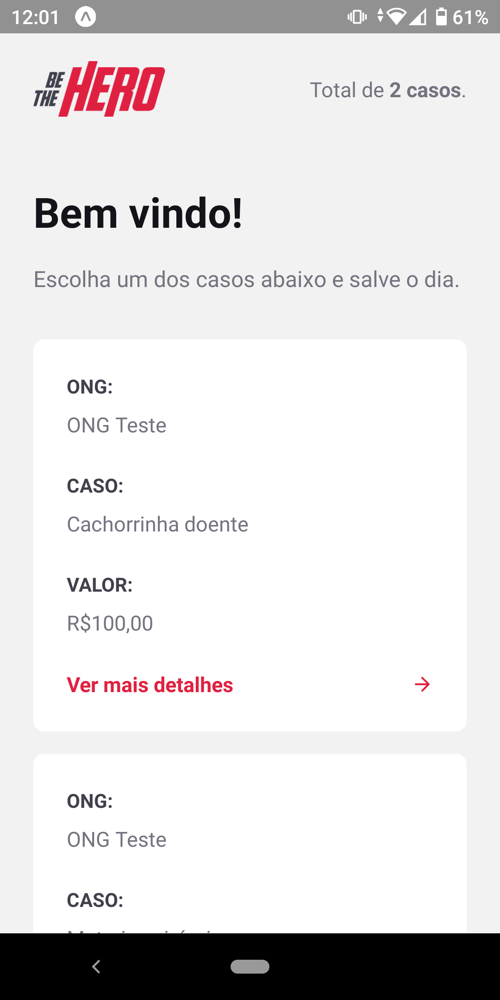
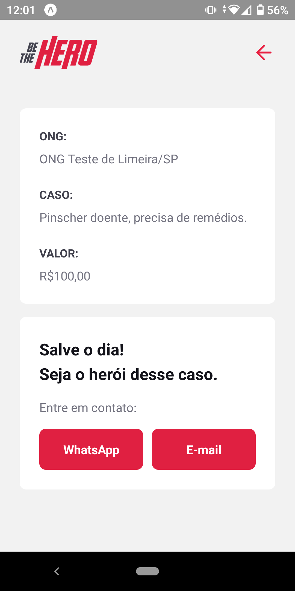
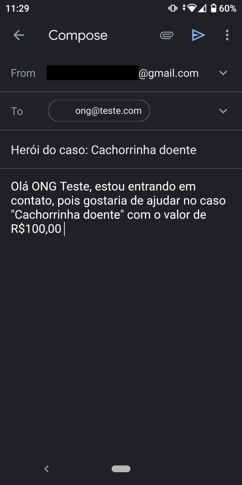
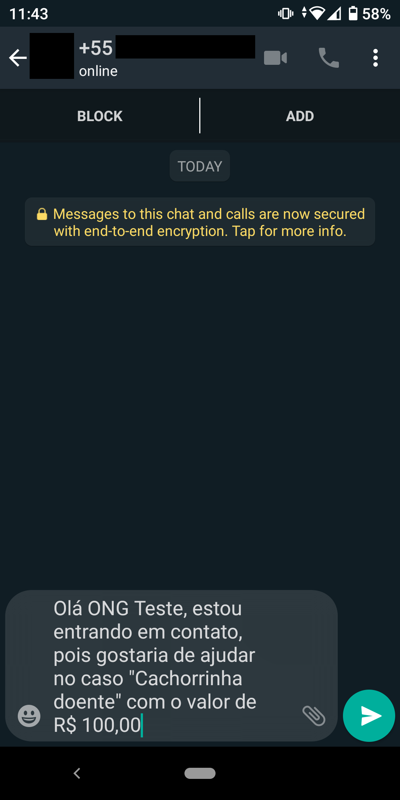

#
Project created to "Semana OmniStack 11" for estudies on:

- Node.js, cross-env, Express (backend)
- SQLite, Knex (database)
- React, Axios (frontend)
- React Native, Expo (mobile)
- Celebrate/Jest (validations)
- Supertest (tests)

# Cool, but... What is this?
Basically, the project connects NGOs with people who want to help.

The NGOs register the cases/incidents through the frontend and people visit the app, considering contacting the NGO via email or whatsapp to help, becoming the hero of this case.

## Backend
Structure with SQLite, RESTful API using Node.js.

## Frontend
React website where NGOs can signup and add cases that need help.

## Mobile
Mobile app. Lists cases and "Heroes" can view them and help, messaging WhatsApp or send an e-mail.

    
