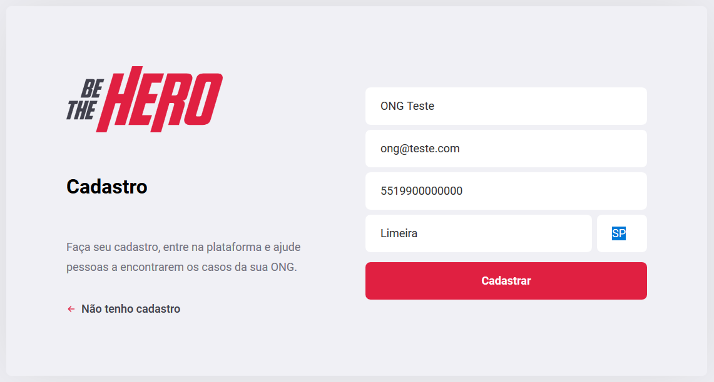
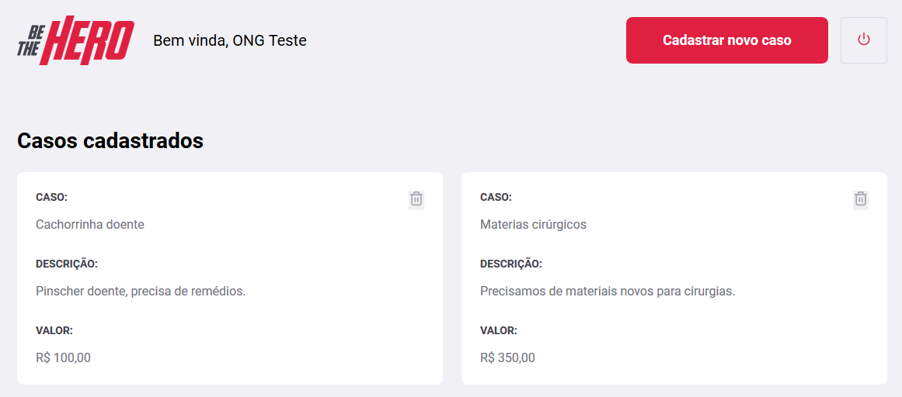
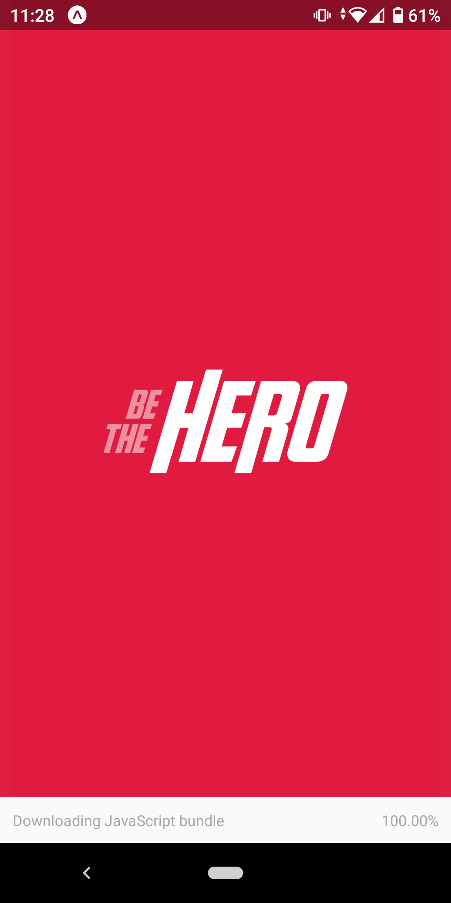
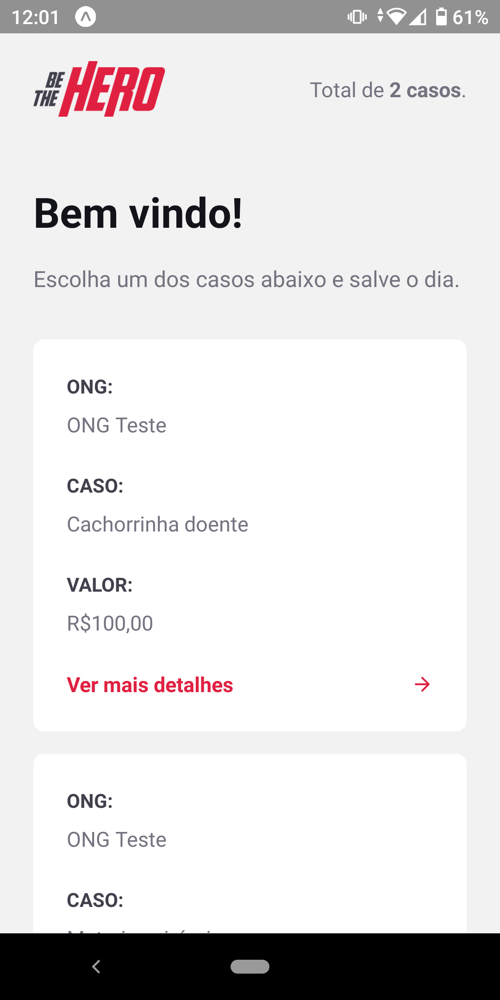
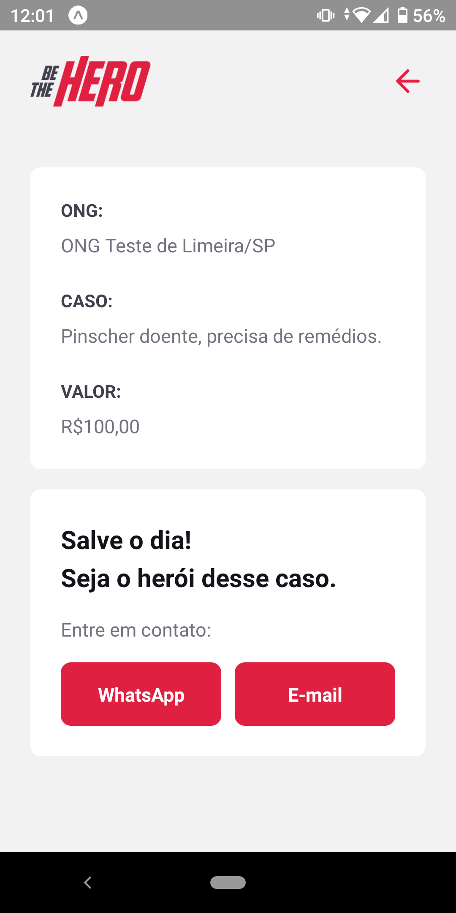
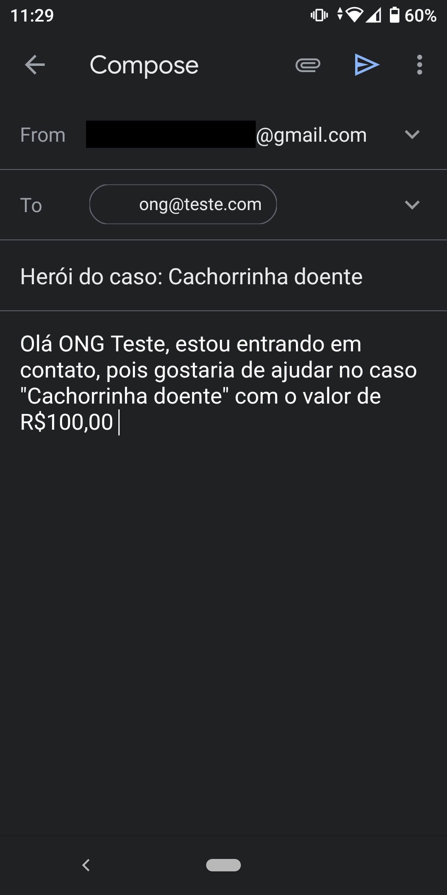
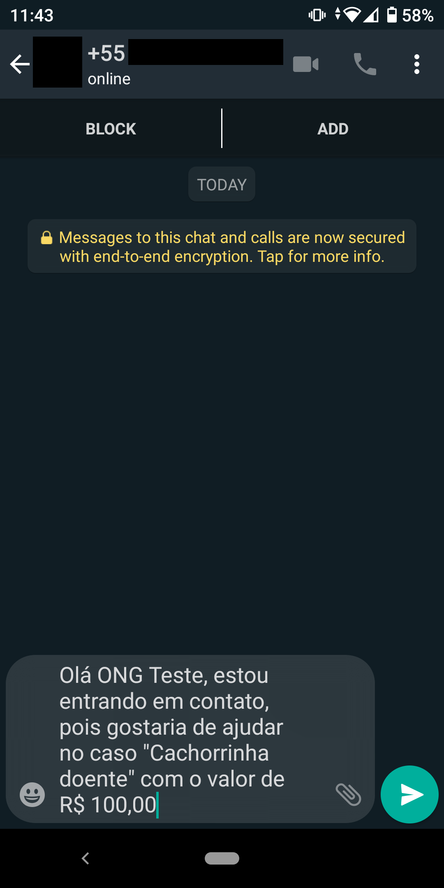

#
Project created to "Semana OmniStack 11" for estudies on:

- Node.js, Express 5, JWT, Helmet, rate limiting (backend)
- SQLite (better-sqlite3), Knex (database)
- React 19, Vite, React Router, Axios (frontend)
- React Native, Expo SDK 57 (mobile)
- Celebrate/Joi (validations)
- Jest, Supertest, Vitest, Testing Library (tests)

# Cool, but... What is this?
Basically, the project connects NGOs with people who want to help.

The NGOs register the cases/incidents through the frontend and people visit the app, considering contacting the NGO via email or whatsapp to help, becoming the hero of this case.

## Backend
Structure with SQLite, RESTful API using Node.js.

### Authentication
`POST /sessions` receives the NGO access id and returns a JWT (HS256). Routes that change or read private NGO data require the header `Authorization: Bearer <token>`:

| Route | Auth |
| --- | --- |
| `POST /sessions`, `POST /ongs` | public, rate limited |
| `GET /ongs`, `GET /incidents` | public (access ids are never exposed) |
| `GET /profile`, `POST /incidents`, `DELETE /incidents/:id` | JWT |

### Running
```bash
cd backend
cp .env.example .env   # set JWT_SECRET (at least 32 chars)
npm install
npm run migrate
npm run dev
npm test
```

## Frontend
React website where NGOs can signup and add cases that need help.

```bash
cd frontend
cp .env.example .env   # VITE_API_URL
npm install
npm run dev
npm test
```





## Mobile
Mobile app. Lists cases and "Heroes" can view them and help, messaging WhatsApp or send an e-mail.

```bash
cd mobile
cp .env.example .env   # EXPO_PUBLIC_API_URL
npm install
npm start
npm test
```


    
